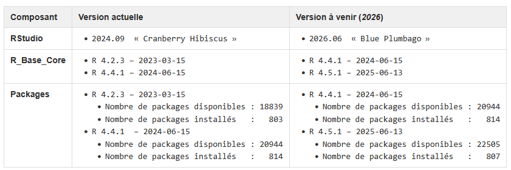

## Calendrier

- Ouverture plateforme de test : 03/08/2026.
- Période de test utilisateur : Jusqu’au 17 septembre 2026
- Ouverture plateforme de production : Prévue début octobre 2026.

## Une mise à jour annuelle

{fig-align="center"}
