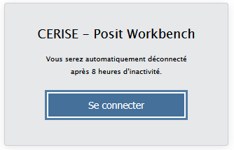

# Contexte et cadrage {.backgroundTitre}

## Calendrier

- Ouverture plateforme de test : 03/08/2026.
- Période de test utilisateur : Jusqu’au 17 septembre 2026
- Ouverture plateforme de production : Prévue début octobre 2026.

## Une mise à jour annuelle

{fig-align="center"}

## Une montée en puissance de l'infrastructure

::: {.callout-important icon=false title="Mise en place du load balancing"}
Le Load Balancing (ou équilibrage de charge) consiste à distribuer le trafic informatique sur plusieurs serveurs au lieu de tout envoyer vers une seule machine.

💡 Note : Le load balancing distribue automatiquement le trafic entre plusieurs instances de manière totalement transparente pour l'utilisateur sur Cerise.
:::

:::: {.columns}

::: {.column width="50%"}

 **Production**

Passage à une haute disponibilité :  
Avant : 3 instances (350 Go RAM)  
Après : 10 instances en load balancing (2,5 To RAM)
:::

::: {.column width="50%"}

 **Test / Recette**

Capacité accrue pour les tests de charge :  
Avant : 2 instances (128 Go RAM)  
Après : 5 instances en load balancing (650 Go RAM)
:::

::::

 

::: {.callout-success icon=false}

**Bénéfices clés**  
⚡ Meilleure répartition de la charge   
⏱️ Réduction des temps d’attente  
🚀 Scalabilité accrue  

:::

## Nouvelle gestion des sessions

Sécurité : mise en place de authentification OIDC (ajout d'une étape/clic à la connexion)

{fig-align="center"}

- Limite de sessions simultanées : **3 sessions max par utilisateur** (pour garantir des ressources équitables).  
- Timeout des sessions inactives : Fermeture automatique après **4 jours d’inactivité** (pour libérer les ressources).  
  
Profils de sessions :  

- **Default et Medium** : Accessibles à tous (adaptés à la majorité des usages).  
- **Large et Superuser** : Disponibles sur demande (pour les besoins intensifs en RAM/CPU).  

[Contactez le support pour demander un profil étendu :]{.red} [assistance.si-stat.sg@agriculture.gouv.fr]{.blue}