# Contexte et cadrage {.backgroundTitre}

## Calendrier


- Ouverture plateforme de test : 03/08/2026.
- Période de test utilisateur : Jusqu’au 17 septembre 2026
- Ouverture plateforme de production : Prévue début octobre 2026.


## Une mise à jour annuelle

{fig-align="center"}

## Une montée en puissance de l'infrastructure

::: {.callout-important icon=false title="Mise en place du load balancing"}
Le Load Balancing (ou équilibrage de charge) consiste à distribuer le trafic informatique sur plusieurs serveurs au lieu de tout envoyer vers une seule machine.

💡 Note : Le load balancing distribue automatiquement le trafic entre plusieurs instances de manière totalement transparente pour l'utilisateur sur Cerise.
:::

:::: {.columns}

::: {.column width="50%"}

 **Production**

Passage à une haute disponibilité :  
Avant : 3 instances (350 Go RAM)  
Après : 10 instances en load balancing (2,5 To RAM)
:::

::: {.column width="50%"}

 **Test / Recette**

Capacité accrue pour les tests de charge :  
Avant : 2 instances (128 Go RAM)  
Après : 5 instances en load balancing (650 Go RAM)
:::

::::

<br>

::: {.callout-success icon=false}

**Bénéfices clés**  
⚡ Meilleure répartition de la charge   
⏱️ Réduction des temps d’attente  
🚀 Scalabilité accrue  

:::

## Nouvelle gestion des sessions

Sécurité : mise en place de authentification OIDC (ajout d'une étape/clic à la connexion)

{fig-align="center"}

- Limite de sessions simultanées : **3 sessions max par utilisateur** (pour garantir des ressources équitables).  
- Timeout des sessions inactives : Fermeture automatique après **4 jours d’inactivité** (pour libérer les ressources).  
  
Profils de sessions :  

- **Default et Medium** : Accessibles à tous (adaptés à la majorité des usages).  
- **Large et Superuser** : Disponibles sur demande (pour les besoins intensifs en RAM/CPU).  

[Contactez le support pour demander un profil étendu :]{.red} [assistance.si-stat.sg@agriculture.gouv.fr]{.blue}

## Demande d'assistance liée à la montée de version de Cerise

Le BQIS vous fournit le template de mail suivant :  
  
::: {.callout-note icon=false title="Exemple de mail"}
Pour : [assistance.si-stat.sg@agriculture.gouv.fr]{.blue}    

Sujet : [CERISE][Montée de version] Description succinte  

• Environnement : PPRD/QLF - PROD  
• Version de R_Base :  
• Chemin du programme :  
• Descriptif de l'erreur rencontrée :  
*Joindre éventuellement le rapport d'erreur si disponible ou une copie d'écran.*  
:::

# Nouvelles fonctionnalités {.backgroundTitre}

## Une page d'accueil modifiée (1/4)

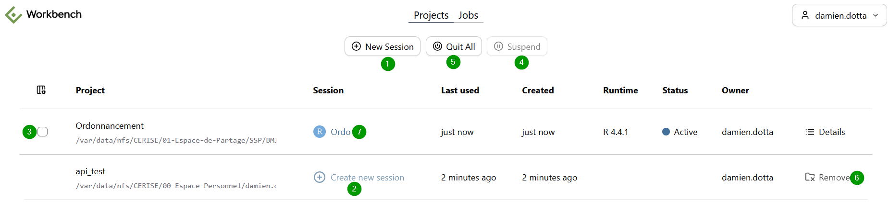{fig-align="center"}

Utilisez le bouton en haut à gauche de la fenêtre pour personnaliser les informations contenus dans votre page d'accueil.

## Une page d'accueil modifiée (2/4)

La page d'accueil vous permet de :

1. Lancez de nouvelles sessions autonomes 
2. Lancer une nouvelle session rattaché à un projet précédemment ouvert.
3. Sélectionner une session en cours
4. Suspendre la session sélectionnée
5. Fermer le session sélectionnée
6. Supprimer l'affichage des projets précédemment ouverts
7. 🆕 Attribuer un nom pertinent à vos sessions 

## Une page d'accueil modifiée (3/4)

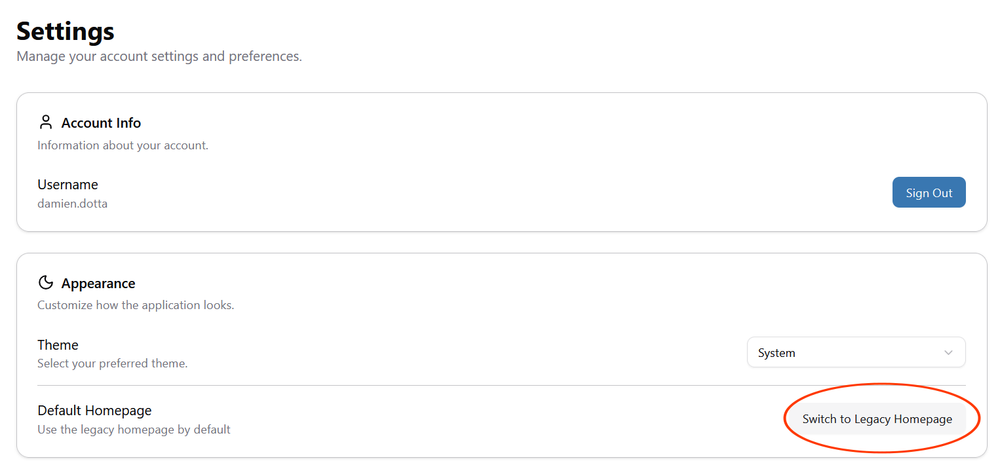{fig-align="center"}

## Une page d'accueil modifiée (4/4)

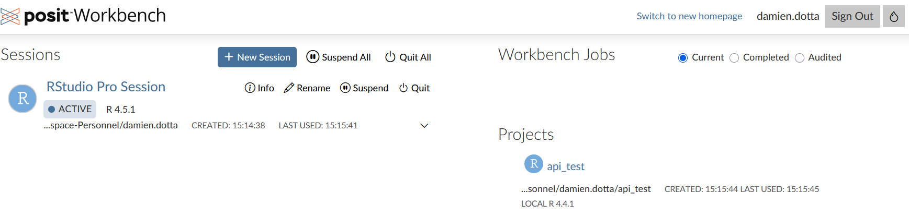{fig-align="center"}

## Le data viewer summary

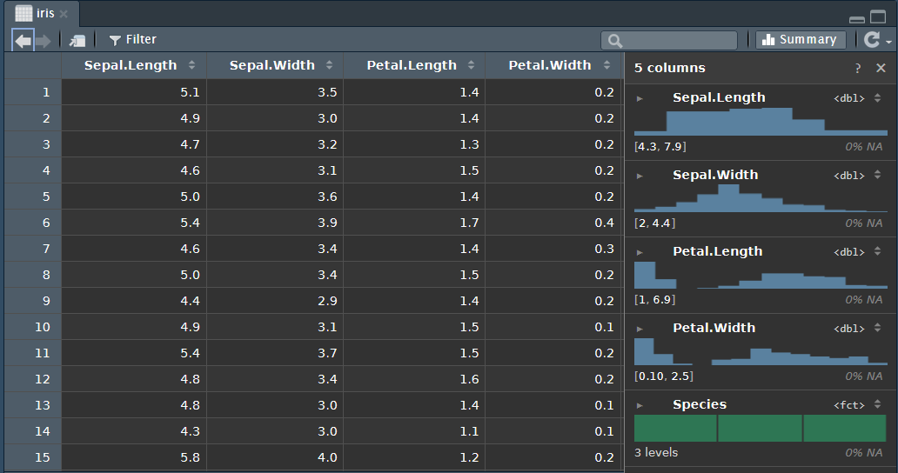{fig-align="center"}

## Une nouvelle sidebar

:::: {.columns}

::: {.column width="50%"}
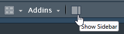{fig-align="center"}
:::

::: {.column width="50%"}
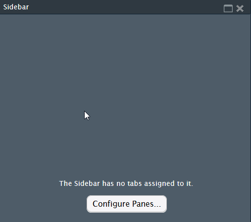{fig-align="center"}
:::

::::

## Recherche textuelle dans la console

Il est désormais possible de faire une recherche textuelle dans la console R 

{fig-align="center"}

## typst

Typst (0.13.1) est désormais nativement intégré dans RStudio et permet de générer des documents pdf sans installation nécessaire 


````{.bash}
---
title: "Recette Technique C3P 2026"
author: "La R team"
format: typst
---
   
## Test de rendu ultra-rapide
   
Si ce document compile en moins de 2 secondes, le moteur Typst est opérationnel.
 
### Un graphique
 
```{.r}
#| eval: true
#| echo: false
 
library(ggplot2)
ggplot(mtcars, aes(wt, mpg)) +
  geom_point(color = "#0073C2") +
  theme_minimal()
```
````

## Les workbench jobs (1/5)

Il est désormais possible de lancer des "Workbench jobs" depuis une session.  
  
Contrairement aux "Background Jobs" classiques qui tournent en arrière-plan au sein de la même session R, les "Workbench Jobs" lancent l'exécution de scripts R dans des sessions totalement indépendantes et distinctes.  
  
Cette fonctionnalité pourra permettre d'exécuter des scripts lourds ou de longs calculs. Contrairement aux jobs d'arrière-plan classiques, ils s'exécutent dans un processus distinct, ce qui signifie que vous pouvez continuer à coder ou même fermer votre session RStudio Pro sans jamais interrompre l'exécution de vos tâches


## Les workbench jobs (2/5)

Pour lancer un "Workbench Job", renseigner les deux fenêtres suivantes :

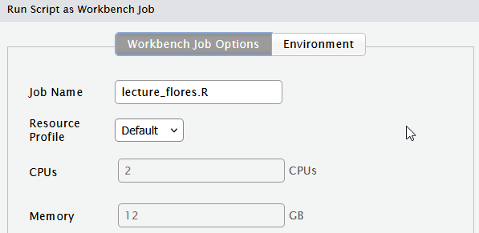{fig-align="center"}

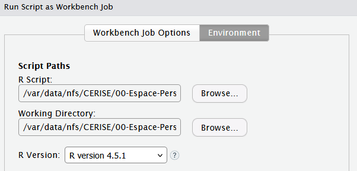{fig-align="center"}

## Les workbench jobs (3/5)

Le Job se retrouve dans l'onglet Job de Posit Workbench :

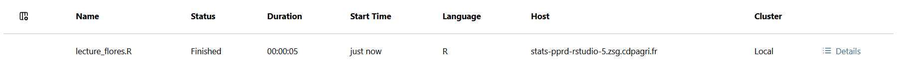{fig-align="center"}
  
Et dans la session RStudio :  

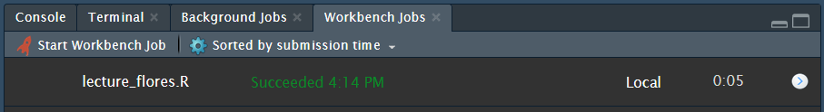{fig-align="center"}


## Les workbench jobs (4/5)

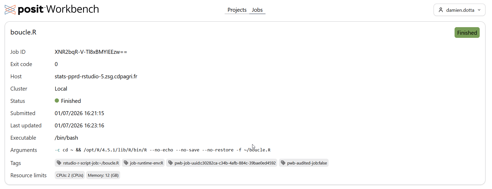{fig-align="center"}

## Les workbench jobs (5/5)

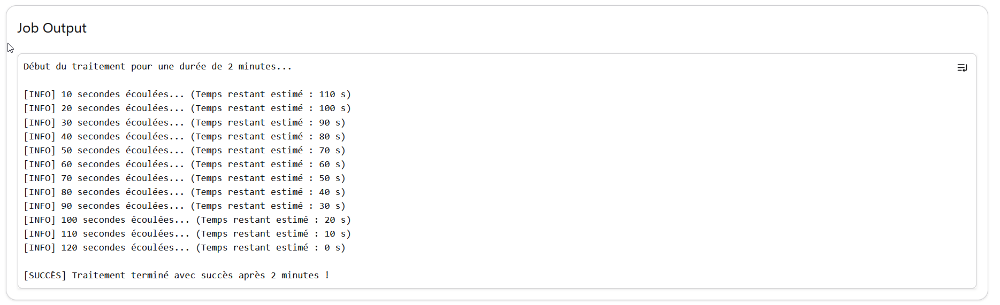{fig-align="center"}
REMARQUE IMPORTANTE SUR LES WORKBENCH JOB :  

Tout script soumis en Workbench Job doit être 100 % autonome. Le job s’exécutant dans un processus distinct, il n'hérite d'aucune variable ni état défini dans votre console active. Initialisez systématiquement toutes vos variables et paramètres de contexte directement à l'intérieur du script.

# Points divers {.backgroundTitre}

## Projets avec {renv}

Les projets R importants ainsi que les applications shiny qui utilisent le `renv` pour la gestion des packages seront migrés par le PAOS au T4 2026.  
  
En attendant, il est conseillé de fixer la version de R à 4.4.1 pour continuer à utiliser ces applications/projets.  

## Formatteur air

RStudio gère désormais nativement le formatage du code via [Air](https://posit-dev.github.io/air/).  

Disponible via le menu `Code` :

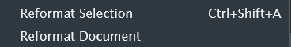{fig-align="center"}

:::: {.columns}

::: {.column width="50%"}
Sans air :  
  
```{.r}
library(  dplyr)

test<-letters

calcul_moyenne<-function( x , y ){
  res =  mean(x ,na.rm=TRUE ) + sum( y )
  if(res> 10){
    return( res )
  }else{ return(0) }
}

```
:::

::: {.column width="50%"}
Avec air :  
  
```{.r}
library(dplyr)

test <- letters

calcul_moyenne <- function(x , y) {
  res =  mean(x , na.rm = TRUE) + sum(y)
  if (res > 10) {
    return(res)
  } else{
    return(0)
  }
}

```
:::

::::

## Quid de Python ?

Pas d'installation spécifique faite sur Cerise. Il y a seulement la version de Python qui est livrée avec Red Hat :  

- Actuellement, Python 3.6 avec RHEL 8  
- Sur C3P, Python 3.9 avec RHEL 9  

Il est possible de faire du python en utilisant le package R {reticulate}. 


## Interactions avec la forge gitlab

Git est également monté de version (2.47.1).
N'hésitez pas à faire remonter au BQIS d'éventuels dysfonctionnements de Git sous Cerise.  

Pour les nouveaux arrivants au 1er septembre qui souhaitent utiliser Git, 2 cas de figure :   

1. Vous avez déjà utilisé Git et il vous faut suivre ce [tutoriel de configuration](https://github.com/user-attachments/files/30405999/Tutoriel.-.Configuration.d.une.connexion.Cerise_Gitlab.pdf) sous Cerise.  
  
2. Vous n'avez jamais utilisé Git => inscrivez vous aux formations à venir.

## Quarto

Monté de version de quarto en 1.9.38

Dans certains cas d'usages (des documents quartos utilisés par plusieurs utilisateurs) il se peut que des problèmes d'écriture se produisent sur la nouvelle version de Cerise.  

=> **Si tel est le cas, faire un mail à l'assistance**.

## Autres cas

- Le package Eulerr n'est actuellement pas installable sur le nouveau Cerise.  

Si vous constatez d'autres manques, signalez-nous le !